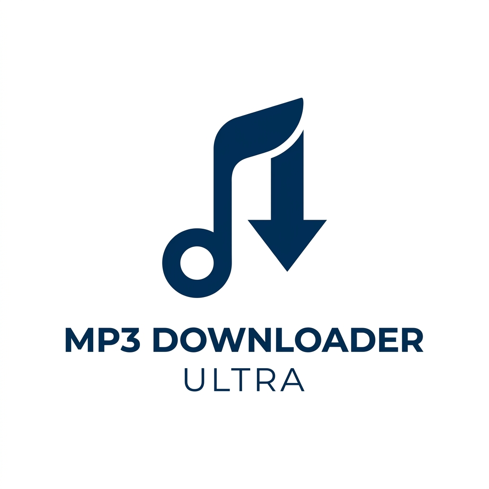
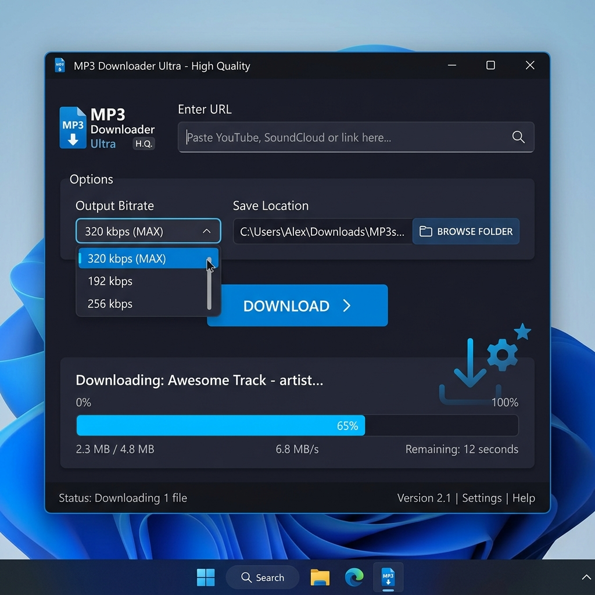

  

# ShokzFlow - MP3 Downloader 🎵
**La solución definitiva para descargar música en alta calidad, optimizada para tus Shokz OpenSwim Pro y deportistas.**

---

## 🌊 El Problema y la Solución
¿Cansado de descargar música para tus **Shokz OpenSwim Pro** y que las pistas se desordenen, el audio suene "roto" o la interfaz sea lenta?

**ShokzFlow** ha sido diseñado buscando la perfección técnica:
*   **Audio sin fisuras**: Soporte para **VBR 0 / 320kbps (MAX Quality)** con re-muestreo a 44.1kHz para máxima compatibilidad con hardware deportivo.
*   **Inteligencia de Orden**: El modo "Shokz" antepone numeración `01 - `, `02 - ` automáticamente basándose en el orden real de la playlist.
*   **Experiencia Premium**: Sin anuncios, código abierto y en un ejecutable portable.

---

## 📸 Interfaz de Usuario

  

---

## ☕ Apoya el proyecto
Si te gusta ShokzFlow y te ahorra tiempo y dolores de cabeza, puedes invitarme a un café. ¡Toda ayuda es bienvenida para seguir mejorando la herramienta!

  

---

## 🚀 Instalación y Uso

### 👤 Para Usuarios (Uso RÁPIDO)
Si solo quieres disfrutar de tu música:
1.  Ve a la sección de [Releases](https://github.com/JuananGCoy/MP3_Downloader_Ultra/releases).
2.  Descarga `ShokzFlow.exe`.
3.  Ábrelo y ¡listo! Portable y limpio.

### 💻 Para Desarrolladores
1.  Clona el repositorio: `git clone https://github.com/JuananGCoy/MP3_Downloader_Ultra.git`
2.  Instala dependencias: `pip install -r requirements.txt`
3.  Asegúrate de incluir `ffmpeg.exe` y `ffprobe.exe` en la raíz.
4.  Ejecuta con `python main.py`.

---

## 🔨 Compilación
Para generar tu propio portable:
1.  Ejecuta `python build_app.py`.
2.  Tu ejecutable aparecerá en la carpeta `dist`.

---

  Hecho con ❤️ por <b>Juanan el mejor</b>.

